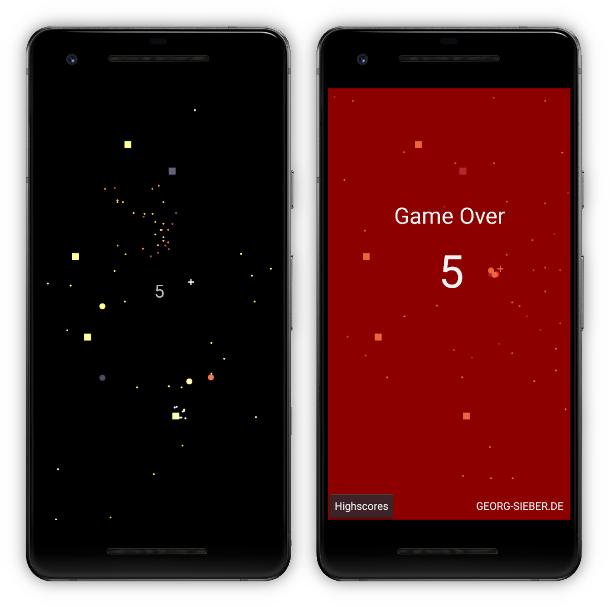

# BallBreak-Android

The goal of the mini-game BallBreak is to make the balls -which follow your finger- bounce off the squares. Do not touch a ball or a square with your finger.

It is also available for [iOS](https://github.com/schorschii/BallBreak-iOS).

## Screenshots

